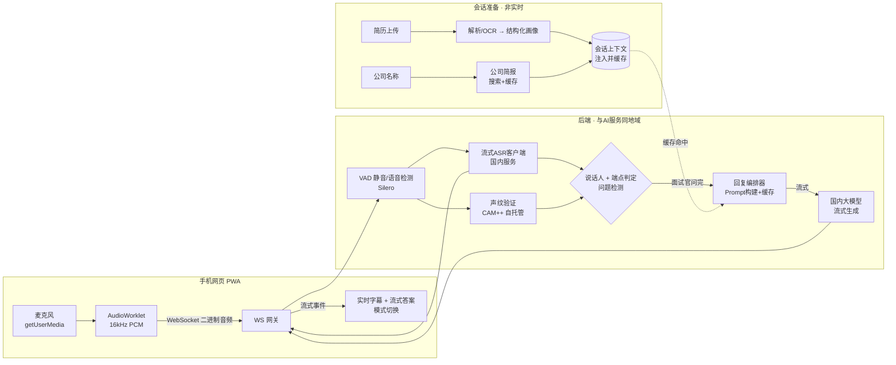

# AI 辅助面试工具 — 技术方案文档

> 版本 v1.0 ｜ 日期 2026-06-15
> 形态：手机网页端（PWA）｜ 音频：手机麦克风声学拾音 ｜ AI：国内流式语音识别 + 国内大模型

---

## 0. 一句话定义

用户电脑上进行远程面试，手机网页端实时**听取房间声音 → 区分面试官/本人 → 一旦面试官问完，AI 立刻给出结构化/口语化的参考回答**，并自动结合用户简历和应聘公司信息。

两条硬指标：
1. **快**：从「面试官说完」到「屏幕出现可用的第一句话」目标 ≤ 1.0–1.3 秒，全程流式输出。
2. **两种回复模式**：口语化问答 / 公考式结构化作答，可一键切换或自动识别。

---

## 1. 核心难点与可行性判断（先说实话）

选定「手机麦克风拾音」这条路，最省事（纯网页、零安装），但有三个必须正视的现实约束：

| 难点 | 现实 | 本方案对策 |
|---|---|---|
| **单麦克风区分两个人** | 一个麦克风同时收到「电脑外放的面试官声音」+「用户本人直接说话」，传统说话人分离（diarization）在实时单通道下不稳。 | **不做通用分离，改做「声纹注册 + 说话人验证」**：开场让用户念一句话注册声纹，之后每段话只判断「是不是用户本人」——不是本人 = 面试官 = 触发 AI。两说话人 + 一方已知，问题大幅简化，且快。 |
| **必须外放** | 用户若戴耳机，手机收不到面试官声音。 | 产品上强约束：提示「面试官声音用电脑外放」；做回声/降噪。这是该路线的固有前提，文档里明确告知用户。 |
| **延迟** | 端点检测（判断「问完了」要等一小段静音）天然占掉几百毫秒，是「感觉快不快」的大头。 | 流式 ASR + 上下文缓存 + 投机式预生成 + 首屏先给「核心一句话」。详见 §4。 |

> 结论：方案**可行**，但分离准确率和「外放前提」是这条路线的天花板。若日后想要 100% 干净分离 + 更低延迟，升级路径是「电脑端小工具推双路音轨」（已在备选，§12）。

---

## 2. 整体架构

**为什么要有后端？** 三个原因：① 国内 ASR/LLM 的密钥不能放在手机网页里；② 说话人验证、端点判定、问题检测、Prompt 编排需要一个有状态的协调层；③ 上下文缓存要由服务端统一管理。后端要**和 ASR/LLM 部署在同一云厂商同一地域**，把网络 RTT 压到最低。

---

## 3. 端到端延迟预算（指标 #1 的核心）

目标：面试官说完 → 屏幕出现第一个有用字。

| 阶段 | 预算 | 说明 / 优化 |
|---|---|---|
| 手机 → 服务器（音频上行） | 20–60 ms | 同地域、WebSocket 二进制、20–40ms 分片 |
| 流式 ASR partial 返回 | 100–300 ms | 边说边出字，不等说完 |
| **端点检测（静音判定）** | **300–700 ms** | **延迟大头**。可调静音窗；用语义完整度+静音双判据 |
| 声纹判定 | < 50 ms | 与 ASR 并行，在该语音段上跑，不串行加时 |
| LLM 首字 TTFT（命中缓存） | 200–500 ms | 简历/公司/系统提示词全部缓存，每次只发问题 |
| 服务器 → 手机（首 token） | 20–60 ms | SSE/WebSocket |
| **合计到首个有用字** | **≈ 0.7 – 1.3 s** | 之后持续流式输出 |

**把「感觉」做快的三招**（比单纯压数字更重要）：
1. **首屏先给一句话**：LLM 先吐「核心答案/思路一句话」，用户 1 秒内就有话可说，再展开细节。
2. **投机式预生成**：当 ASR partial 已是一个完整问句（含「吗/呢/请谈谈/为什么/如何」或问号）时，在 final 之前就预热/起草，问题若继续再修正。
3. **全程可见**：实时把面试官的话以字幕显示，用户看到「在听、在转」，主观等待感大幅下降。

---

## 4. 音频采集与说话人分离

### 4.1 前端采集
- `getUserMedia({audio})` 拿麦克风，开启浏览器内置 `echoCancellation / noiseSuppression / autoGainControl`。
- `AudioWorklet` 把 Float32 → 16-bit PCM、降采样到 **16kHz 单声道**，按 ~20–40ms 分片走 WebSocket 二进制上行（不要用 MediaRecorder 压缩，省编解码延迟）。

### 4.2 声纹注册（开场一次，约 5–8 秒）
- 让用户朗读一句固定话术（如自我介绍开头）。
- 服务端用自托管 **CAM++ / ERes2Net**（达摩院 3D-Speaker，开源，CPU 可跑）算出用户声纹向量并存会话。

### 4.3 实时判定
- 每个语音段（由 VAD 切分）→ 算声纹向量 → 与注册向量算余弦相似度。
- 相似度 ≥ 阈值 → **用户在说**（不触发 AI，可显示「你在回答」状态）。
- 低于阈值 → **面试官在说** → 进入问题检测。
- 辅助特征（提升鲁棒性）：面试官声音来自外放，通常带轻微混响/带限/音量偏小；用户为近场直达声。可作为声纹的兜底特征。

---

## 5. 实时识别与触发逻辑

- **VAD**：Silero VAD（开源、轻量）做语音/静音切分与端点检测；也可直接用 ASR 自带的 `is_final / 句末` 事件。
- **触发判定**（「面试官问完了，该答了」）：
  - 条件：当前段判定为面试官 + ASR 返回该句 final + 静音 ≥ 端点窗（面试官窗设 ~700ms，比用户略宽，避免多句问题被截断）。
  - **背景音过滤**：对「嗯、好的、可以、那个」这类口头backchannel 不触发（轻量规则 + 短句长度阈值）。
  - **多句问题**：若面试官停顿后又继续，允许「追加 + 重新生成」，或在静音窗内合并。
- **问题分类**（用于选框架，见 §6）：一个极轻量分类（可由 LLM 在同一次调用里先判类型，或本地规则）判断是「行为/技术/综合分析/计划组织/应急应变/人际/自我认知」等。

---

## 6. AI 回复引擎（两种模式）

两种模式本质是**同一引擎、不同的系统提示词与输出模板**。

### 6.1 口语化问答模式
- 风格：第一人称、自然、像真人临场会说出口的话；**2–4 句、先结论后理由**；不堆术语。
- 适合：企业面试的行为/技术/开放题。
- 输出：先一句「核心回答」，再补 1–2 句支撑（结合简历经历）。

### 6.2 公考结构化作答模式
按题型自动套用标准框架，输出**分点骨架（一是…二是…三是…）+ 过渡语**，正式书面语：

| 题型 | 作答框架 |
|---|---|
| 综合分析（社会现象/政策/观点哲理） | 表态/解释 → 分析（积极+消极/原因+影响）→ 对策落实 |
| 计划组织协调（调研/宣传/活动/培训） | 目的意义 → 事前准备 → 事中执行重点 → 事后总结提升 |
| 应急应变（突发情况） | 控制局面/明确任务 → 分轻重缓急 → 分类处理 → 总结预防 |
| 人际关系（领导/同事/群众） | 阳光心态 → 主动沟通 → 换位思考 → 解决 → 自我反省 |
| 自我认知/岗位匹配 | 岗位要求 × 个人经历 × 匹配度 → 表决心 |

- **首屏策略**：先输出框架骨架（各点小标题），让用户秒看结构，再逐点填充内容——结构化答案虽长，但用户能立刻照着说。

### 6.3 上下文缓存（延迟关键）
- 把「系统提示词 + 用户简历画像 + 公司简报 + 当前模式」组成**固定前缀**，用国内模型的 **Context Caching**（豆包 / 通义 / 文心均支持）缓存。
- 每次请求只发「面试官的问题（+最近几轮对话）」，命中缓存后 TTFT 显著下降、成本也降。

### 6.4 模型分层（质量 vs 速度）
- 口语化模式：用更快的轻模型（豆包-lite / Qwen-Turbo / GLM-Flash）。
- 公考结构化：答案长且讲究质量，可用稍强模型（豆包-pro / Qwen-Plus），其首屏骨架仍能快速出现。

---

## 7. 简历与公司信息（自动参考）

- **简历**：上传 PDF/图片/文本 → PDF 用 PyMuPDF 抽取文字、图片用 PaddleOCR（中文强）→ LLM 结构化成画像（教育/经历/项目/技能/亮点）。
- **公司**：输入公司名称 → 会话准备阶段用搜索 API（如博查/天眼查类）拉取「公司主营/规模/价值观/近期动态」生成**公司简报**并缓存（**不在实时回答时联网**，避免加延迟）。
- 二者在会话开始时注入并缓存（§6.3），实时回答时零额外开销。

---

## 8. 前端（手机网页）设计

- **技术**：React + Vite，做成 **PWA**（可加桌面、全屏、息屏策略）。
- **音频**：AudioWorklet 采集 PCM → WebSocket 上行；答案经 WebSocket 流式下发。
- **交互（面试中不能瞎点）**：
  - 顶部状态条：`在听 / 面试官提问中 / 你在回答 / 生成中`。
  - 中部：面试官问题实时字幕。
  - 主区：**大字号、可滚动**的流式答案；口语化/结构化一键切换。
  - 底部：一键「重答/换个角度」、一键「清屏」（隐蔽）。
  - 历史：本场 Q&A 列表，可回看。

---

## 9. 后端服务设计

- **技术**：Python + FastAPI（异步）+ WebSocket。Python 便于跑 Silero VAD（torch）、CAM++ 声纹（ModelScope），且各国内 ASR 都有 Python SDK；LLM 用 httpx 流式。
- **模块**：WS 网关 / VAD / ASR 客户端 / 声纹验证 / 端点+说话人路由 / 回复编排 / LLM 流式 / 简历解析 / 公司简报。

### WebSocket 协议（草案）
- 客户端 → 服务端：
  - 二进制：PCM 音频帧（16kHz/16bit/mono）。
  - JSON 控制：`{type:"start", mode}`、`{type:"enroll_voiceprint"}`、`{type:"set_mode", mode}`、`{type:"regenerate"}`。
- 服务端 → 客户端（JSON 事件）：
  - `partial_transcript {text}` / `final_transcript {text, speaker}`
  - `question_detected {text, qtype}`
  - `answer_delta {text}` / `answer_done`
  - `status {state}`

---

## 10. 技术选型清单（国内）

| 能力 | 首选 | 备选 |
|---|---|---|
| 流式 ASR（中文、低延迟、含角色/说话人能力） | 火山引擎流式语音识别 | 阿里云实时语音识别 / 讯飞实时转写 / 腾讯云 |
| 声纹（自托管，低延迟、零调用费） | 达摩院 3D-Speaker **CAM++ / ERes2Net**（ModelScope 开源） | 阿里云声纹 / 讯飞声纹（云 API） |
| 大模型（快 + 中文 + Context Caching） | 豆包 Doubao / 通义 Qwen-Plus·Turbo | 文心 ERNIE-Speed / 智谱 GLM-4-Flash / DeepSeek-V3 |
| VAD | Silero VAD（开源） | webrtcvad |
| 简历解析 | PyMuPDF + PaddleOCR | LLM 直接读图（多模态） |
| 公司简报 | 博查搜索 / 天眼查类 API | 通用搜索 API |
| 前端 | React + Vite (PWA) | 原生 JS |
| 后端 | Python FastAPI | Node + Python 声纹/VAD 边车 |
| 部署 | 与 ASR/LLM 同云同地域；CPU 即可（Silero+CAM++ 小模型） | 加 GPU 提升声纹/并发 |

---

## 11. 数据模型 / 存储

- `Session`：mode、状态、创建时间。
- `VoiceprintEmbedding`：用户声纹向量（会话级，结束即删）。
- `ResumeProfile`：结构化简历画像。
- `CompanyBrief`：公司简报。
- `QAHistory`：每轮 {question, qtype, answer, ts}。
- 存储：会话态用内存/Redis；简历/公司可短期持久化（加密，会话后清理）。

---

## 12. 分阶段实施路线

- **P0 · 风险验证（强烈建议先做，1 条主链路打通）**
  手机拾音 → 上行 → 流式 ASR → 声纹区分用户/面试官 → 端点触发 → LLM 流式回答 → 手机显示。**只验证：分离够不够准、端到端延迟到底多少。** 这是项目成败的关键，先把数字测出来。
- **P1 · 两种模式 + 简历/公司注入**：加 mode 切换、Prompt 模板、上下文缓存、简历解析、公司简报。
- **P2 · 延迟优化**：首屏一句话、投机式预生成、缓存调优、模型分层、背景音过滤。
- **P3 · 产品化**：PWA 体验、历史回看、稳定性/重连、隐蔽交互、数据加密与清理。
- **P4（可选）升级路线**：电脑端小工具推「系统声音+麦克风」双路干净音轨，彻底解决分离与延迟（突破 §1 天花板）。

---

## 13. 风险与合规

- **法律/合规（务必正视）**：在中国，**公务员考试等「法律规定的国家考试」中作弊可能触犯《刑法》第 284 条之一**（组织考试作弊 / 为作弊提供器材、帮助）。企业招聘面试中使用此类工具通常违反诚信与招聘规则。**强烈建议把产品定位为「模拟面试练习 / 面后复盘 / 表达训练」**，并对真实国家考试场景设限与风险提示，避免法律与平台合规风险。
- **分离准确率**：单麦+外放，受环境噪音、用户是否外放影响 → 声纹阈值调优 + 降噪 + 明确「外放」前提。
- **延迟**：端点静音窗是大头 → 见 §3 三招。
- **误触发**：backchannel 过滤 + 句长阈值。
- **隐私**：音频/简历属敏感数据 → 传输 TLS、存储加密、会话结束即删声纹与音频、最小化留存。

---

## 14. 关键性能优化清单（速查）

1. 同云同地域部署，砍网络 RTT。
2. PCM 直传，不做有损编码。
3. 上下文缓存固定前缀（简历+公司+系统词）。
4. 声纹/VAD 与 ASR 并行，不串行加时。
5. 首屏先吐「核心一句话 / 结构骨架」。
6. 完整问句的投机式预生成。
7. 模型分层：口语化用快模型，结构化用强模型。
8. 实时字幕降低主观等待感。
