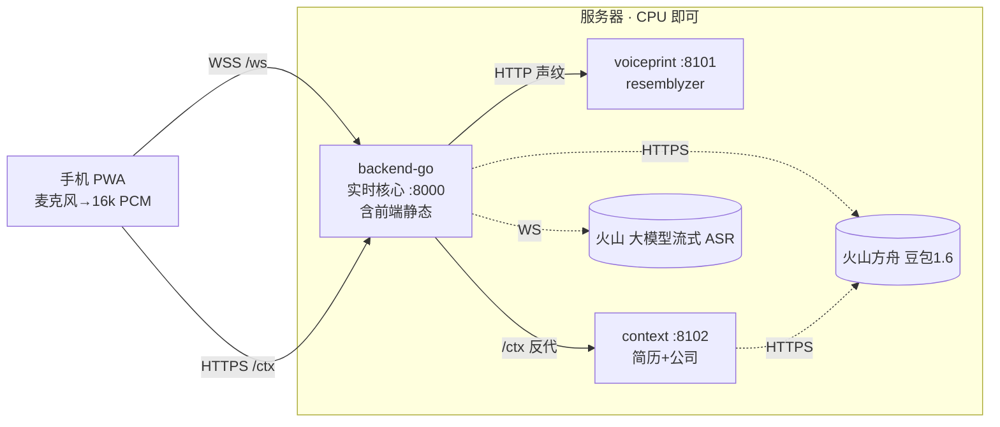

# AI 实时面试辅助工具

手机网页(PWA)实时辅助电脑端面试：手机麦克风拾音 → 区分面试官/本人 → 面试官一问完，AI 立刻给出**口语化**或**公考结构化**参考答案；可上传简历、填写应聘公司，AI 自动结合。

> ⚠️ 合规：公考等属国家考试，实时作弊可能触犯《刑法》第 284 条之一；企业面试使用亦违反诚信规则。**建议定位为「模拟面试 / 面后复盘 / 表达训练」**，勿用于真实国家考试。详见 [技术方案](AI面试辅助工具-技术方案.md)。

## 架构



| 服务 | 目录 | 端口 | 语言/技术 | 职责 |
|---|---|---|---|---|
| 实时核心 | [backend-go/](backend-go/) | 8000（对外唯一入口） | Go + gorilla/websocket | WS 网关、火山 ASR 流、豆包 LLM 流、编排、声纹调用、托管前端、`/ctx` 反代 |
| 声纹 | [services/voiceprint/](services/voiceprint/) | 8101（内网） | Python + resemblyzer | 声纹注册 + 逐句验证（区分本人/面试官） |
| 上下文 | [services/context/](services/context/) | 8102（内网） | Python + PyMuPDF + 豆包多模态 | 简历解析、公司简报 |
| 前端 | [web/](web/) | 构建产物由 backend 托管 | Vite + TS (PWA) | 采集/注册/双模式/流式/历史/简历上传 |

手机端只接触 **8000** 一个端口：`/ws`(语音) 与 `/ctx`(简历/公司) 都经 backend 同源转发，省去 CORS 与 HTTPS 混合内容问题。

## 快速开始（Docker，推荐）

```bash
cp .env.example .env      # 填入 VOLC_APP_KEY / VOLC_ACCESS_KEY / ARK_API_KEY
docker compose up -d --build
# 打开 http://<服务器IP>:8000 （手机用麦克风需 HTTPS，见下）
```

- 还没有火山 key？把 `.env` 里 `ASR_PROVIDER` 和 `LLM_PROVIDER` 都改成 `mock`，即可先把界面与链路跑起来。
- 首次启动 `voiceprint` 会装 CPU 版 torch 并加载模型，健康检查 start-period 给了 180s，请耐心等其 healthy 后 backend 才启动。

## 无需 GPU

所有重计算（语音识别、大模型）都在**火山云端**。服务器本地只有很轻的活：声纹是小模型 **CPU 推理**（逐句 ~20–80ms），简历解析是 CPU。**2–4 vCPU / 4–8GB 内存**即可起步。真正影响延迟的是到火山的网络 RTT，**建议服务器部署在火山同地域（如华北/北京）**。

## 上手机（HTTPS 必需）

手机浏览器要用麦克风必须 HTTPS。两种方式：
- 内网穿透：`cloudflared tunnel --url http://<服务器IP>:8000`，用它给的 https 域名。
- 反向代理：Caddy/Nginx 终止 TLS 回源到 `:8000`（WebSocket 需开 Upgrade 透传）。

## 本地开发（不走 Docker）

```powershell
# 1) 实时核心（mock，免 key）
cd backend-go; $env:ASR_PROVIDER="mock"; $env:LLM_PROVIDER="mock"; go run .
# 2) 上下文服务
cd services/context; ./run.ps1
# 3) 前端（dev server，已代理 /ws->8000、/ctx->8102）
cd web; npm install; npm run dev    # http://localhost:5173
# 4) 声纹（需 Python 3.11/3.12 装 torch；本机仅 3.14 时为降级模式）
cd services/voiceprint; ./run.ps1
```

## 火山凭证从哪拿

- **大模型流式 ASR**：火山引擎控制台 → 语音技术 → 开通「大模型流式语音识别」，拿 App Key / Access Key（`X-Api-App-Key` / `X-Api-Access-Key`），Resource-Id 默认 `volc.bigasr.sauc.duration`。
- **豆包 LLM**：火山引擎控制台 → 火山方舟 → 在线推理，拿 API Key（`ARK_API_KEY`）。模型用 `doubao-seed-1.6-flash`（快）/ `doubao-seed-1.6`（强）。

## 环境变量

见 [.env.example](.env.example)。要点：`VOLC_APP_KEY`/`VOLC_ACCESS_KEY`（ASR）、`ARK_API_KEY`（LLM/简历/公司）、`ASR_PROVIDER`/`LLM_PROVIDER`(volc/ark 或 mock)、`SPEAKER_THRESH`、`MODEL_FAST`/`MODEL_STRONG`。

## CI/CD 与发布

推送代码后由 GitHub Actions（[.github/workflows/build-and-publish.yml](.github/workflows/build-and-publish.yml)）自动构建 3 个镜像并推送到 **GHCR**：
`ghcr.io/skadli/interview-backend`、`-voiceprint`、`-context`。

- **发版**：`./scripts/release.sh v1.0.0`（打标签触发构建，产出 `:1.0.0` 与 `:latest`）。
- **服务器拉取发布**：`./scripts/deploy.sh`（`docker compose -f docker-compose.prod.yml pull && up -d`）。
- **自动部署（可选）**：在仓库 Settings → Secrets 配置 `DEPLOY_SSH_HOST`/`DEPLOY_SSH_USER`/`DEPLOY_SSH_KEY`/`DEPLOY_PATH`（私有镜像再加 `GHCR_USER`/`GHCR_TOKEN`），则 push main 或打标签后自动 SSH 到服务器 `pull && up -d`。未配置则只发布镜像、不部署。

生产服务器用 [docker-compose.prod.yml](docker-compose.prod.yml)（直接拉镜像，不本地构建）：
```bash
cp .env.example .env          # 只需填 3 个 key（镜像地址等已写死在 compose 里）
docker compose -f docker-compose.prod.yml pull && docker compose -f docker-compose.prod.yml up -d
# GHCR 包默认私有：先 docker login ghcr.io（用户名 + 一个有 read:packages 的 PAT），或在仓库把 3 个包设为 Public
```

## 各服务文档
[backend-go](backend-go/README.md) ｜ [voiceprint](services/voiceprint/README.md) ｜ [context](services/context/README.md) ｜ [web](web/README.md) ｜ [总体技术方案](AI面试辅助工具-技术方案.md)

> `p0/` 是早期 Python + mock 原型，已验证全链路，仅作参考，不参与生产部署。
