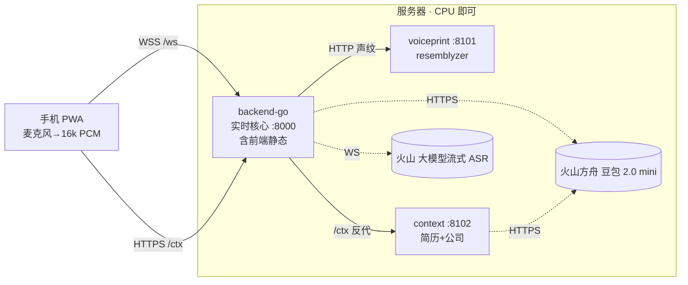

<div align="center">

# 🎙️ AI 实时面试辅助工具

**手机网页(PWA)实时辅助电脑端面试 —— 面试官一问完，AI 立刻给出可直接念出口的参考答案**

手机麦克风拾音 → 区分面试官/本人 → 面试官问完，AI 立刻给出**口语化**或**公考结构化**参考答案；可上传简历、填写应聘公司，AI 自动结合。

[](https://github.com/Skadli/interview/actions/workflows/build-and-publish.yml)
&nbsp;
&nbsp;
&nbsp;
&nbsp;

</div>

> [!WARNING]
> **合规提示**：公考等属国家考试，实时作弊可能触犯《刑法》第 284 条之一；企业面试使用亦违反诚信规则。**建议定位为「模拟面试 / 面后复盘 / 表达训练」**，勿用于真实国家考试。详见 [技术方案](AI面试辅助工具-技术方案.md)。

---

## ✨ 特性

- ⚡ **低延迟** —— 语音识别与大模型全在火山云端，本地只做很轻的声纹推理
- 🎯 **说话人分离** —— 开场念一句注册声纹，逐句验证"本人/面试官"，**只在面试官提问时触发** AI
- 🗣️ **两种作答模式** —— 口语化（结论先行、有逻辑有重点）/ 公考结构化（完整正式答案）
- 📄 **简历 + 公司** —— 上传简历、填写应聘公司，AI 自动结合作答
- 📱 **纯网页 PWA** —— 手机只需浏览器，无需装 App；对外只暴露一个 `:8000` 端口
- 🐳 **单镜像部署** —— 前端 + Go 实时核心 + 声纹 + 上下文，supervisor 一容器拉起
- 🧮 **无需 GPU** —— 2–4 vCPU / 4–8GB 内存即可起步

## 🏗 架构



> [!NOTE]
> 部署为**单个镜像** `skadli/interview`：容器内由 supervisor 同时拉起下面三个进程（前端由 Go 托管）。

| 组件 | 目录 | 容器内端口 | 语言/技术 | 职责 |
|---|---|---|---|---|
| 实时核心 | [backend-go/](backend-go/) | **8000**（对外唯一入口） | Go + gorilla/websocket | WS 网关、火山 ASR 流、豆包 LLM 流、编排、声纹调用、托管前端、`/ctx` 反代 |
| 声纹 | [services/voiceprint/](services/voiceprint/) | 8101（容器内） | Python + resemblyzer | 声纹注册 + 逐句验证（区分本人/面试官） |
| 上下文 | [services/context/](services/context/) | 8102（容器内） | Python + PyMuPDF + 豆包多模态 | 简历解析、公司简报 |
| 前端 | [web/](web/) | 由 backend 托管 | Vite + TS (PWA) | 采集/注册/双模式/流式/历史/简历上传 |

手机端只接触 **8000** 一个端口：`/ws`(语音) 与 `/ctx`(简历/公司) 都经 backend 同源转发，省去 CORS 与 HTTPS 混合内容问题。

## ⚡ 快速开始（Docker，推荐）

```bash
cp .env.example .env      # 填入 VOLC_API_KEY（火山语音）与 ARK_API_KEY（方舟豆包）
docker compose up -d --build
# 浏览器打开 http://<服务器IP>:8000  （手机用麦克风需 HTTPS，见下）
```

> [!TIP]
> **还没有火山 key？** 把 `docker-compose.yml` 里的 `ASR_PROVIDER`、`LLM_PROVIDER` 都改成 `mock`，即可先把界面与全链路跑起来。

> [!NOTE]
> 镜像默认含 CPU 版 torch（声纹用），较大较慢。**想要小镜像**：`docker compose build --build-arg WITH_TORCH=0`（声纹降级为"不分离"，体积大幅减小）。容器内声纹加载 torch 需些时间，但对外的 `:8000` 健康检查很快就绪。

## 🧮 无需 GPU

所有重计算（语音识别、大模型）都在**火山云端**。服务器本地只有很轻的活：声纹是小模型 **CPU 推理**（逐句 ~20–80ms），简历解析是 CPU。**2–4 vCPU / 4–8GB 内存**即可起步。真正影响延迟的是到火山的网络 RTT，**建议服务器部署在火山同地域（如华北/北京）**。

## 📱 上手机（HTTPS 必需）

手机浏览器要用麦克风必须 HTTPS。两种方式：

- **内网穿透**：`cloudflared tunnel --url http://<服务器IP>:8000`，用它给的 https 域名。
- **反向代理**：Caddy/Nginx 终止 TLS 回源到 `:8000`（WebSocket 需开 `Upgrade` 透传）。

## 🔑 火山凭证从哪拿

> [!IMPORTANT]
> 本项目用到火山引擎**两个产品**，对应**两个互不相同的 key**：语音 key 调方舟会 401，反之亦然。

- **流式 ASR**：火山引擎控制台 → 语音技术 → 开通「豆包流式语音识别2.0」，新版控制台拿单个 **API Key**（填 `VOLC_API_KEY`，走 `X-Api-Key`）。`VOLC_RESOURCE_ID` 默认 `volc.bigasr.sauc.duration`（它才是真正的"用哪个模型"开关）。仍是旧版控制台（App ID + Access Token 两段式）时，改填 `VOLC_APP_KEY` / `VOLC_ACCESS_KEY` 并留空 `VOLC_API_KEY`（代码两者都兼容）。
- **豆包 LLM**：火山方舟 → 开通模型 / 创建推理接入点，拿 **API Key**（`ARK_API_KEY`）。模型默认 `doubao-seed-2-0-mini-260428`（最新快模型）；用接入点 `ep-xxx` 可启用上下文缓存（`ARK_CONTEXT_CACHE=true`，失败自动回退）。

## ⚙ 环境变量

完整示例见 [.env.example](.env.example)。常用项（默认值取自 [backend-go/config.go](backend-go/config.go)）：

| 变量 | 默认 | 说明 |
|---|---|---|
| `ASR_PROVIDER` | `mock` | `volc` 走火山流式 ASR；`mock` 免 key 跑通链路（compose 默认设为 `volc`） |
| `LLM_PROVIDER` | `mock` | `ark` 走方舟豆包；`mock` 免 key（compose 默认设为 `ark`） |
| `VOLC_API_KEY` | — | 火山语音新版统一鉴权（`X-Api-Key`） |
| `VOLC_RESOURCE_ID` | `volc.bigasr.sauc.duration` | **真正的 ASR 模型选择器** |
| `VOLC_ASR_MODEL` | `bigmodel` | 请求里的 `model_name`（占位/兼容） |
| `ARK_API_KEY` | — | 方舟豆包 LLM key（与语音 key 不同） |
| `MODEL_FAST` / `MODEL_STRONG` | `doubao-seed-2-0-mini-260428` | 口语化用 Fast、结构化用 Strong（默认同模型） |
| `ARK_CONTEXT_CACHE` | `false` | 上下文缓存（需 `MODEL_*` 设为接入点 `ep-xxx`；失败回退） |
| `SPEAKER_SIDECAR_URL` | 空 | 声纹服务地址；空则不分离（全部视为面试官） |
| `SPEAKER_THRESH` | `0.75` | 声纹相似度阈值（≥ 视为本人） |
| `ENDPOINT_MS` | `650` | 句尾静音端点（仅 mock 能量 VAD 用，volc 由服务端决定） |

> [!NOTE]
> 单镜像内声纹 / 上下文是同容器进程，地址已内置为 `127.0.0.1:8101` / `127.0.0.1:8102`，无需手动配 `SPEAKER_SIDECAR_URL` / `CONTEXT_URL`。

<details>
<summary><b>💻 本地开发（不走 Docker）</b></summary>

```powershell
# 1) 实时核心（mock，免 key）
cd backend-go; $env:ASR_PROVIDER="mock"; $env:LLM_PROVIDER="mock"; go run .
# 2) 上下文服务
cd services/context; ./run.ps1
# 3) 前端（dev server，已代理 /ws->8000、/ctx->8102）
cd web; npm install; npm run dev    # http://localhost:5173
# 4) 声纹（需 Python 3.11/3.12 装 torch；本机仅 3.14 时为降级模式）
cd services/voiceprint; ./run.ps1
```

后端单测：`cd backend-go; go test ./...`（mock ASR + mock LLM 跑通编排，校验事件序列与提示词拼装）。

</details>

## 🚀 CI/CD 与发布

推送代码即由 GitHub Actions（[build-and-publish.yml](.github/workflows/build-and-publish.yml)）自动构建**单个三合一镜像**，并**同时推送到两个 registry**：

| Registry | 镜像 | 说明 |
|---|---|---|
| 🐳 Docker Hub | `docker.io/skadli/interview` | 公开，`docker pull` 免登录 |
| 📦 GHCR | `ghcr.io/skadli/interview` | GitHub 包，默认私有 |

**触发与标签**
- push 到 `main` → 产出 `:main`、`:<short-sha>`、`:latest`
- 打 `v*` 标签 → 产出对应**语义版本**（如 `v1.2.0` → `:1.2.0`，并刷新 `:latest`）

**发布一个版本**

```bash
git tag v1.0.0 && git push origin v1.0.0   # 触发构建，产出 :1.0.0 与 :latest
```

**服务器更新到最新发布**（用 [docker-compose.prod.yml](docker-compose.prod.yml)，拉单镜像、不本地构建）

```bash
cp .env.example .env          # 只需填 key
docker compose -f docker-compose.prod.yml pull
docker compose -f docker-compose.prod.yml up -d
```

> [!NOTE]
> 生产 compose 默认用 GHCR 镜像，而 **GHCR 包默认私有**：服务器先 `docker login ghcr.io`（用户名 + 具 `read:packages` 的 PAT），**或**把 compose 里 `image:` 换成公开的 `docker.io/skadli/interview:latest` 免登录直接拉。

> [!TIP]
> **自动部署（可选）**：仓库 Settings → Secrets 配 `DEPLOY_SSH_HOST` / `DEPLOY_SSH_USER` / `DEPLOY_SSH_KEY` / `DEPLOY_PATH`（可选 `DEPLOY_SSH_PORT`；私有镜像再加 `GHCR_USER` / `GHCR_TOKEN`、Docker Hub 推送需 `DOCKERHUB_TOKEN`），push main 或打标签后自动 SSH 到服务器执行 `pull && up -d`。未配置则只发布镜像、不自动部署。

## 📚 各服务文档

[backend-go](backend-go/README.md) ｜ [voiceprint](services/voiceprint/README.md) ｜ [context](services/context/README.md) ｜ [web](web/README.md) ｜ [总体技术方案](AI面试辅助工具-技术方案.md)

> [!NOTE]
> `p0/` 是早期 Python + mock 原型，已验证全链路，仅作参考，不参与生产部署。
